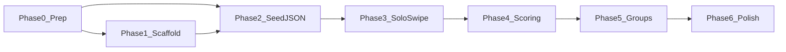
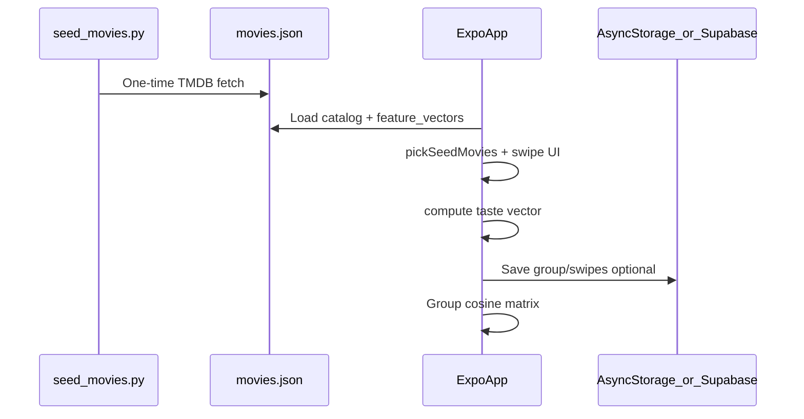

# Showtime: Tech Stack, Feasibility, and Build Plan

> Living project plan for a **personal iOS project** (not App Store / not published). Edit this file as scope changes.
>
> **Platform:** iOS only (v1) · **Groups:** async (invite link, swipe on your own time) · **Run via:** Simulator, Expo Go, or a local dev build on your phone

**You have:** Figma base designs · TMDB API key (for one-time seeding only)  
**Start with:** [Phase 0 — Prep](#phase-0--prep-you-do-this-first) below, then work through phases in order.

### Documentation


| Document                                                 | Purpose                                                       |
| -------------------------------------------------------- | ------------------------------------------------------------- |
| **[PLAN.md](PLAN.md)** (this file)                       | **Active plan** — v2 local `movies.json`, current phases      |
| **[docs/PLAN_v1_archived.md](docs/PLAN_v1_archived.md)** | **Archived plan** — original Supabase Edge + live TMDB design |


---

## Current architecture (v2 — local movie data)

**Decision (2026-05-28):** We are **not** calling the TMDB API live during development or at runtime. We are **not** using Supabase Edge Functions for movie fetching or scoring.

Instead:

1. Run a **one-time** Python script `[scripts/seed_movies.py](scripts/seed_movies.py)` that hits TMDB once and writes `[data/movies.json](data/movies.json)` (~200 movies with pre-computed `feature_vector`s).
2. The **Expo app** (and any light local helpers) read **only** from `movies.json` for posters, metadata, seed decks, and taste math.
3. **TMDB API key** lives in `.env` as `TMDB_API_KEY` — used **only** by the seed script, never shipped in the app.

**Why:** Faster to build in a few days—no Edge deploy cycle, no rate limits while UI debugging, reproducible scoring, works offline.

**Supabase (optional, Phase 5+):** May still be used **only for async group state** (members, swipes, completion)—not for TMDB. Can be replaced with AsyncStorage for an even smaller solo demo.

The previous Supabase Edge + live TMDB design lives in **[docs/PLAN_v1_archived.md](docs/PLAN_v1_archived.md)** (separate file—open that for the full old plan, diagrams, and Edge Function list).




---

## Build checklist (by phase)

### Phase 0 — Prep

- Node.js 20+, Xcode (Simulator), optional Expo Go on iPhone
- Python 3.10+ for seed script (`python3 -v`)
- Figma frames named (see table below); Figma URL saved in Open decisions
- `.env` with `TMDB_API_KEY` (gitignored) — **seed script only**
- ~~Free Supabase project~~ — **deferred** until Phase 5 if needed for groups

### Phase 1 — Scaffold

- Expo + TypeScript + Expo Router + NativeWind
- Placeholder routes: Home, Join, Swipe, Profile, Group
- `.env.example`, `.gitignore`; app runs on iOS Simulator

### Phase 2 — Local movie data (replaces Supabase Edge + live TMDB)

- `scripts/seed_movies.py` + `requirements.txt` (or documented pip deps)
- Run script once → `data/movies.json` (200 movies, per-genre quotas confirmed in terminal)
- App module reads `movies.json`; pick 10 seed movies for swipe deck
- Debug screen lists real movies from JSON (no network for movie metadata)

### Phase 3 — Solo swipe

- `SwipeOnboarding` screen from Figma (yes / meh / no, progress 1–10)
- Swipes saved (AsyncStorage or local state)
- “Done” state after 10 swipes

### Phase 4 — Taste profile (solo milestone)

- Scoring in **app TypeScript** using `feature_vector` from JSON (not Edge Function)
- `TasteProfile` screen from Figma
- **Solo loop complete:** open app → swipe 10 → see taste profile

### Phase 5 — Async groups

- Group state: Supabase **or** local persistence (document choice in Open decisions)
- Create/join via `showtime://join/{token}`; lobby + results from Figma
- Group compatibility: cosine similarity on profiles (vectors from `movies.json`)

### Phase 6 — Polish

- TMDB attribution in UI (still required—data sourced from TMDB)
- Error states (invalid invite, missing `movies.json`)
- Loading skeletons per Figma

**Skip for personal v1:** App Store, TestFlight, push notifications, Universal Links, Supabase Edge Functions, live TMDB at runtime.

---

## Phase 0 — Prep (you do this first)

### Step 1: Confirm local tools

- **Node.js 20+** — `node -v`
- **Python 3.10+** — `python3 -v` (for `seed_movies.py`)
- **Xcode** — iOS Simulator; open once to accept license
- **Expo Go** on iPhone (optional) — free from App Store

### Step 2: Organize Figma for implementation


| Screen                 | Figma frame name  | App route              |
| ---------------------- | ----------------- | ---------------------- |
| Welcome / create group | `Home`            | `app/index.tsx`        |
| Join group             | `JoinGroup`       | `app/join/[token].tsx` |
| Swipe deck             | `SwipeOnboarding` | `app/swipe.tsx`        |
| Personal taste result  | `TasteProfile`    | `app/profile.tsx`      |
| Group lobby (waiting)  | `GroupLobby`      | `app/group/[id].tsx`   |
| Group compatibility    | `GroupResults`    | `app/group/[id].tsx`   |


### Step 3: TMDB key for seeding only

Create `.env` in project root (gitignored):

```env
TMDB_API_KEY=your_key_here
```

- Used **only** when running `python scripts/seed_movies.py`
- **Never** in Expo app code or committed files
- Re-run seed script occasionally if you want a fresher catalog

### Step 4: Supabase (optional — Phase 5 only)

Skip until async groups. If used later: project URL + anon key in `.env.local` for group tables only—**no Edge Functions for movies**.

**Done when:** Figma named, Python + Node verified, `.env` has TMDB key for seeding.

---

## Phase 1 — Scaffold the app

**Goal:** Empty Expo app runs on iOS Simulator.

1. Expo + TypeScript + Expo Router + NativeWind
2. Placeholder routes (table above)
3. `.env.example` — `TMDB_API_KEY` commented as “seed script only, not used by app”
4. `.gitignore` — `.env`, `node_modules`, `.venv`, optional `data/movies.json` if large

```bash
cd "/Users/auli/Desktop/its showtime"
npm install
npx expo start
# press `i` for iOS Simulator
```

**Done when:** Navigable shell with blank screens.

---

## Phase 2 — Local movie data (`seed_movies.py` + `movies.json`)

**Goal:** ~200 movies on disk; app never calls TMDB at runtime.

### Project layout

```text
its showtime/
  scripts/
    seed_movies.py
  data/
    movies.json          # generated; commit or gitignore (your choice)
  docs/
    tmdb-vector.md       # 13-dim feature_vector schema
  app/                   # Expo app imports from data/movies.json
  .env                   # TMDB_API_KEY — seed only
  requirements.txt       # requests, python-dotenv, numpy
```

### One-time script: `seed_movies.py`

Hits TMDB **once** per run; writes `data/movies.json`.

**Genre quotas (200 total):**


| Bucket    | Count | TMDB `genre_id` |
| --------- | ----- | --------------- |
| comedy    | 25    | 35              |
| drama     | 25    | 18              |
| thriller  | 25    | 53              |
| action    | 25    | 28              |
| horror    | 20    | 27              |
| romance   | 20    | 10749           |
| scifi     | 20    | 878             |
| animation | 20    | 16              |


**Filters (every movie):**

- `vote_count >= 1000`
- `poster_path` present (non-null)

**Fields saved per movie:**


| Field            | Source                                         |
| ---------------- | ---------------------------------------------- |
| `tmdb_id`        | TMDB id                                        |
| `title`          | `title`                                        |
| `year`           | `release_date` → year                          |
| `runtime`        | minutes                                        |
| `genres`         | genre name list                                |
| `genre_ids`      | id list                                        |
| `rating`         | `vote_average`                                 |
| `vote_count`     |                                                |
| `popularity`     |                                                |
| `poster_url`     | `https://image.tmdb.org/t/p/w500{poster_path}` |
| `overview`       | plot text                                      |
| `feature_vector` | 13-dim list (see below)                        |
| `seed_bucket`    | which quota bucket filled (e.g. `"comedy"`)    |


**13-dimensional `feature_vector`** (plain JSON list, built with NumPy in Python):


| Index | Feature                                                                                                     |
| ----- | ----------------------------------------------------------------------------------------------------------- |
| 0–7   | Genre flags: comedy, drama, thriller, action, horror, romance, scifi, animation (1.0 if `genre_id` present) |
| 8     | `runtime` normalized (e.g. `min(runtime/180, 1)`)                                                           |
| 9     | `year` normalized (e.g. clip `(year-1970)/55`)                                                              |
| 10    | `rating` / 10                                                                                               |
| 11    | `popularity` log-normalized                                                                                 |
| 12    | `vote_count` log-normalized                                                                                 |


Document exact formulas in `[docs/tmdb-vector.md](docs/tmdb-vector.md)`. TypeScript scoring must use the **same 13 dims**.

**Script behavior:**

- Paginate TMDB `discover/movie` per genre until quota met
- Dedupe globally by `tmdb_id` (first bucket wins)
- Print **movies saved per genre** + total at end
- Exit non-zero if total < 200 or any bucket under quota

**Run once:**

```bash
cd "/Users/auli/Desktop/its showtime"
python3 -m venv .venv && source .venv/bin/activate
pip install -r requirements.txt
python scripts/seed_movies.py
```

**App integration:**

- Import or bundle `data/movies.json`
- `pickSeedMovies(n=10)` — stratified sample across buckets
- All poster/metadata display from JSON fields
- **No** `fetch-seed-movies` Edge Function

**Done when:** Terminal shows per-genre counts (25/25/…/20) and total 200; app shows real movies from JSON.

---

## Phase 3 — Solo swipe flow

**Goal:** One person swipes 10 movies (yes / no / meh).

- Build `SwipeOnboarding` from Figma
- Seed deck from `pickSeedMovies(10)` in `movies.json`
- Save swipes locally (AsyncStorage)

**Done when:** 10 swipes → “done” (no scoring yet).

**Order:** After Phase 2 — don’t use placeholder movies.

---

## Phase 4 — Taste profile (solo milestone)

**Goal:** Scoring entirely in the **Expo app** (TypeScript).

1. For each swipe, load movie’s `feature_vector` from `movies.json`
2. Weights: yes +1, meh +0.3, no −0.5
3. Sum → L2-normalize → user taste vector (13-dim)
4. Rule-based summary from top dimensions (no LLM required)

**Done when:** open app → swipe 10 → taste profile screen.

---

## Phase 5 — Async groups

**Goal:** Host creates group → share link → friends join → all swipe → compatibility when done.

**Movie data:** Still from `movies.json` on each device (same 10 seeds per group id if stored in group state).

**Group state options (pick one):**


| Option                     | Pros                    | Cons             |
| -------------------------- | ----------------------- | ---------------- |
| **Supabase Postgres only** | Real multi-device async | Extra setup      |
| **Local / AsyncStorage**   | Fastest for demo        | Same device only |


No Supabase Edge required. If using Supabase: tables for `groups`, `group_members`, `swipes`, `taste_profiles` only.

**Done when:** Two clients complete join → swipe → group results.

---

## Phase 6 — Polish

- TMDB attribution in UI
- Handle missing `movies.json` (“Run seed script first”)
- Loading skeletons per Figma

---

## What to do right now


| Order | You                                      | Agent mode                                    |
| ----- | ---------------------------------------- | --------------------------------------------- |
| 1     | Name Figma frames; save Figma URL below  | —                                             |
| 2     | Add `TMDB_API_KEY` to `.env`             | —                                             |
| 3     | `node -v`, `python3 -v`, open Xcode once | —                                             |
| 4     | —                                        | **“scaffold the app”** → Phase 1              |
| 5     | —                                        | **“add seed_movies.py and run it”** → Phase 2 |
| 6     | Share Figma URL                          | Phase 3+ swipe UI                             |


---

## Product summary

**Problem:** Friend groups spend more time negotiating what to watch than getting excited about a movie.

**Audience:** Friend groups of 2–5.

**Core loop:**

1. Each person swipes 10 seeded movies (yes / no / meh) from local catalog.
2. Taste vector = weighted sum of pre-computed `feature_vector`s from `movies.json`.
3. Group compatibility = cosine similarity between members’ vectors.

**Data:** TMDB-sourced metadata **baked into** `movies.json` at seed time; swipes are the only live user input.

---

## What gets built


| Deliverable                  | What it is                                             |
| ---------------------------- | ------------------------------------------------------ |
| `**scripts/seed_movies.py`** | One-time TMDB → `data/movies.json`                     |
| `**data/movies.json**`       | ~200 movies + 13-dim vectors                           |
| **Expo app**                 | Figma screens; reads JSON; in-app scoring              |
| **Optional Supabase**        | Group persistence only (Phase 5)—not required for solo |


---

## Recommended stack (current v2)


| Layer                     | Choice                                                  |
| ------------------------- | ------------------------------------------------------- |
| **Mobile**                | Expo + TypeScript + Expo Router + NativeWind            |
| **Movie catalog**         | `data/movies.json` (bundled or imported)                |
| **Seeding**               | Python 3 + `requests` + `numpy` + `.env`                |
| **Scoring**               | TypeScript in app (cosine similarity on 13-dim vectors) |
| **Group state (Phase 5)** | Supabase Postgres **or** AsyncStorage                   |
| **TMDB at runtime**       | **None**                                                |
| **Supabase Edge**         | **None** (archived approach)                            |
| **LLM (optional)**        | Later; summary text only                                |


---

## Architecture (current v2 — local data)




---

## Taste vector and scoring

**Per-movie:** pre-computed 13-dim `feature_vector` in `movies.json`.

**Per-user:** yes +1, meh +0.3, no −0.5 → sum → L2-normalize.

**Group:** pairwise cosine similarity on 13-dim user vectors.

See `[docs/tmdb-vector.md](docs/tmdb-vector.md)` for schema (create when implementing Phase 2/4).

---

## Data model

### Movie record (`movies.json` array item)

```json
{
  "tmdb_id": 550,
  "title": "Fight Club",
  "year": 1999,
  "runtime": 139,
  "genres": ["Drama", "Thriller"],
  "genre_ids": [18, 53],
  "rating": 8.4,
  "vote_count": 25000,
  "popularity": 61.4,
  "poster_url": "https://image.tmdb.org/t/p/w500/...",
  "overview": "...",
  "feature_vector": [0, 1, 1, 0, 0, 0, 0, 0, 0.77, 0.53, 0.84, 0.42, 0.88],
  "seed_bucket": "drama"
}
```

### Group state (Phase 5 — if using Supabase)

```text
groups(id, invite_token, seed_movie_ids, status, created_at)
group_members(id, group_id, display_name, completed_at)
swipes(id, member_id, tmdb_id, vote)
taste_profiles(member_id, vector jsonb, summary_text)
```

No `movie_cache` table in v2—movies live in JSON.

---

## Feasibility (v2)


| Piece                  | Feasibility | Notes                             |
| ---------------------- | ----------- | --------------------------------- |
| `seed_movies.py`       | High        | One afternoon; paginate per genre |
| App from `movies.json` | High        | No network for movies             |
| Swipe UI               | High        |                                   |
| In-app scoring         | High        | Match 13-dim schema               |
| Async groups           | Medium      | Supabase or local                 |
| Few-day personal build | **High**    | Main reason for v2 pivot          |


---

## Costs (personal project)

- **TMDB:** $0 — key used once at seed time; attribution in UI
- **Expo / Python:** $0
- **Supabase:** $0 if used for groups only; optional
- **Not needed:** Edge Functions, live API proxy, Apple Developer / store fees

---

## Open decisions (fill in as you go)


| #   | Decision                               | Your choice                    |
| --- | -------------------------------------- | ------------------------------ |
| 1   | Figma file URL                         |                                |
| 2   | Commit `data/movies.json` to git?      | yes / no (gitignore + re-seed) |
| 3   | Phase 5 groups: Supabase vs local only |                                |
| 4   | LLM in v1: yes/no                      |                                |


---

## Plain English: Deep links

URL that opens the app on join group screen.

**v1:** `showtime://join/{token}` — no domain required.

---

## Figma → code


| When              | Tool                           |
| ----------------- | ------------------------------ |
| Implement screens | Figma MCP `get_design_context` |


---

## MVP scope

**In scope:** local catalog, 10 swipes, personal + group taste, compatibility matrix, recommendations from `movies.json` pool.

**Out of scope (v2):** live TMDB, Supabase Edge, App Store, push notifications.

---

## Changelog


| Date       | Change                                                                                |
| ---------- | ------------------------------------------------------------------------------------- |
| 2026-05-28 | Initial plan: iOS-only, async groups, Expo + Supabase                                 |
| 2026-05-28 | Personal project: no App Store / paid fees                                            |
| 2026-05-28 | Added phased step-by-step build guide (Phase 0–6)                                     |
| 2026-05-28 | **v2 pivot:** local `movies.json` via `seed_movies.py`; no Supabase Edge or live TMDB |
| 2026-05-28 | v1 plan moved to [docs/PLAN_v1_archived.md](docs/PLAN_v1_archived.md)                 |


