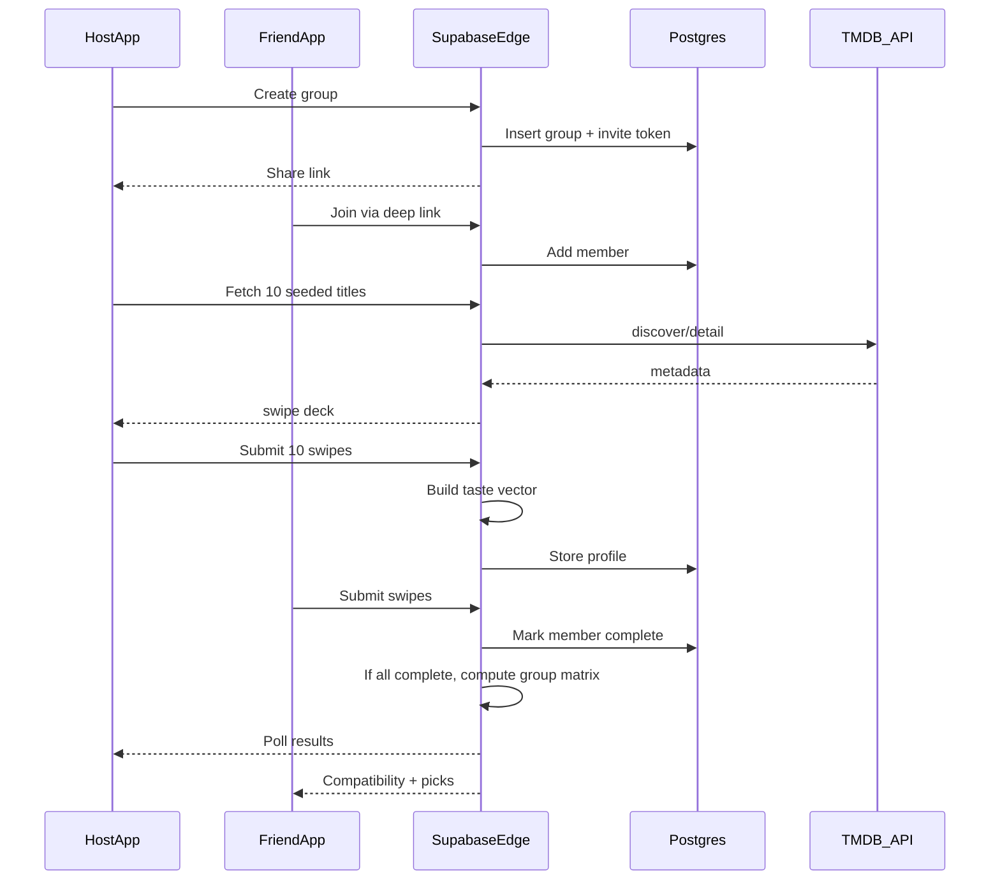
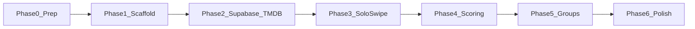

# Showtime — Archived Plan (v1)

> **Status:** Superseded · **Replaced by:** [PLAN.md](../PLAN.md) (v2 — local `movies.json`)  
> **Archived:** 2026-05-28 · Kept for documentation and future scale-up

This file is the **original** architecture before the v2 pivot. Nothing in this document is the active build path unless you explicitly revive v1.

---

## Summary

| Topic | v1 (this document) |
|-------|-------------------|
| Movie data | Live TMDB via Supabase Edge Functions |
| API key | `TMDB_API_KEY` in Supabase secrets (never in app) |
| Cache | Postgres `movie_cache` table |
| Scoring | TypeScript in Edge Functions |
| Groups | Supabase Postgres + Edge Functions from Phase 2 |
| Best for | Production-ish backend, fresh catalog, centralized logic |

---

## Why v1 was replaced (v2 comparison)

| v1 (Edge + live TMDB) | v2 (local JSON) — [current](../PLAN.md) |
|------------------------|----------------------------------------|
| Deploy Edge Functions before UI work | Run `seed_movies.py` once, build UI immediately |
| TMDB rate limits / network while debugging | Stable offline catalog in `data/movies.json` |
| Scoring split across Edge + app | All taste math in Expo TypeScript |
| Supabase required from Phase 2 | Supabase optional until Phase 5 (groups only) |
| Few days personal build | **Harder** | **Easier** |

---

## Product (unchanged)

**Problem:** Friend groups spend more time negotiating what to watch than getting excited about a movie.

**Audience:** Friend groups of 2–5 who watch together regularly.

**Core loop:**

1. Each person swipes on 10 TMDB-seeded movies (yes / no / meh).
2. Backend builds a taste vector from TMDB metadata (genres, tone, pacing, decade, runtime).
3. Group compatibility = cosine similarity between members’ taste vectors.
4. Optional: LLM for readable taste copy—not the sole scoring input.

---

## Stack (v1)

| Layer | Choice |
|-------|--------|
| **Mobile** | Expo (React Native) + TypeScript + Expo Router + NativeWind |
| **Backend** | Supabase (Postgres + Auth + Edge Functions) |
| **TMDB** | Edge Function proxy only |
| **Scoring** | TypeScript in Edge Function |
| **Deep links** | Expo Linking + custom URL scheme (`showtime://join/{token}`) |
| **Notifications** | Expo Notifications + Supabase trigger (optional) |
| **LLM (optional)** | OpenAI / Anthropic via Edge Function |

---

## Architecture (v1 — async flow)





---

## Plain English: Supabase Edge Functions (v1)

**Supabase** = hosted database + auth + API so async group data lives in the cloud.

**Edge Functions** = short TypeScript on Supabase servers; the app calls over HTTPS—not on the phone.

**Why not TMDB from the phone:**

1. API key must not ship in the app
2. Scoring logic in one place, changeable without app rebuild
3. Cache movie metadata in `movie_cache`

**Edge Functions in v1:**

| Function | Purpose |
|----------|---------|
| `fetch-seed-movies` | TMDB discover → 10 diverse titles → cache in `movie_cache` |
| `compute-taste-profile` | Weighted vectors + rule-based summary |
| `create-group` | Invite token + share link |
| `join-group` | Add member |
| `submit-swipes` | Save swipes; when all complete → group cosine matrix |

---

## Build phases (v1 — historical checklist)

### Phase 0 — Prep
- [ ] Node.js 20+, Xcode, optional Expo Go
- [ ] Figma frames named
- [ ] Free Supabase project (URL + anon + service role keys)
- [ ] TMDB key ready for **Supabase secrets** (not `.env` in app)

### Phase 1 — Scaffold
- [ ] Expo + Router + NativeWind; placeholder routes
- [ ] `.env.example` with Supabase URL + anon key

### Phase 2 — Backend + live TMDB
- [ ] `movie_cache` table in Supabase
- [ ] Edge Function `fetch-seed-movies` + `TMDB_API_KEY` secret
- [ ] App displays 10 real movies from Edge Function

### Phase 3 — Solo swipe
- [ ] `SwipeOnboarding` from Figma
- [ ] Swipes to Supabase session or AsyncStorage

### Phase 4 — Taste profile
- [ ] Edge Function `compute-taste-profile`
- [ ] `TasteProfile` screen from Figma

### Phase 5 — Async groups
- [ ] Tables: `groups`, `group_members`, `swipes`, `taste_profiles`
- [ ] Edge Functions: create / join / submit + group matrix
- [ ] Home, Join, GroupLobby, GroupResults from Figma

### Phase 6 — Polish
- [ ] TMDB attribution, errors, loading states

---

## Data model (v1)

```text
groups(id, host_id, invite_token, status, created_at)
group_members(id, group_id, display_name, completed_at)
swipe_sessions(id, member_id, completed_at)
swipes(id, session_id, tmdb_id, vote)  -- yes | no | meh
taste_profiles(member_id, vector jsonb, summary_text)
movie_cache(tmdb_id, features jsonb, fetched_at)
```

Same 10 seed movies per group via `fetch-seed-movies` (diverse TMDB discover).

---

## Taste vector and scoring (v1)

**Per-movie vector (in `movie_cache`):** genres, keywords, runtime bucket, decade, vote_average, etc.

**Per-user:** yes +1, meh +0.3, no −0.5 → sum → L2-normalize.

**Group:** pairwise cosine similarity; heatmap in UI.

**LLM (optional):** summary text only—not the similarity signal.

---

## Feasibility (v1)

| Piece | Feasibility | Notes |
|-------|-------------|-------|
| TMDB + Edge proxy | High | Rate limits → cache |
| Supabase Edge setup | Medium | Deploy + secrets |
| Swipe UI | High | |
| Async groups + deep links | Medium | Custom URL scheme |
| Few-day personal build | Medium | More moving parts than v2 |

---

## Costs (v1 personal project)

- TMDB: $0 with attribution
- Supabase: free tier
- Expo: free (Simulator / Expo Go)
- No App Store fees required for local dev
- LLM: optional pay-per-use

---

## When to revisit v1

Consider switching back from v2 to this architecture if:

- Catalog must stay fresh without shipping new `movies.json` / app updates
- You need multi-device groups with a single source of truth from day one
- You want centralized scoring changes without App Store / OTA updates
- Movie pool grows beyond practical bundled JSON size
- You move toward a public or multi-tenant launch

---

## Changelog (v1 document)

| Date | Change |
|------|--------|
| 2026-05-28 | Archived from active PLAN.md when v2 (local JSON) was adopted |
