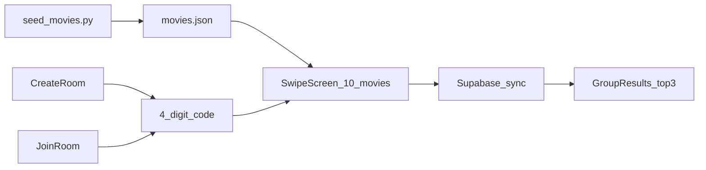

# MP2 — it's showtime — Competencies 1, 2, 3, 4, 7 & 8

**C8 — Building and deploying a complete tool** *(primary)*
**C1 — Vibecoding** · **C2 — Code literacy and documentation** · **C3 — Data cleaning and file handling** · **C4 — APIs and data acquisition** · **C7 — Critical evaluation and professional judgment** *(secondary)*

> The end-of-quarter narrative for this project lives in [reflection.md](reflection.md). This file is the **competency evidence document**: what got built, where to find the evidence, and the specific decisions behind each claim. **C5 / C6** are not claimed here — they are covered in [week5.md](week5.md) and [week6.md](week6.md).

---

## What I built (MP2)

1. **Problem and audience.** Friend groups of 2–5 spend more time negotiating what to watch than getting excited about a movie. *it's showtime* is an async web app where one person hosts a room, shares a 4-digit code, and everyone swipes the same ten movies on their own time — the app then ranks the catalog by group fit and surfaces the top three picks. Product framing lives in `PLAN.md` under "Product summary".
2. **Deployed app.** Live at **https://its-showtime-eight.vercel.app** (Vercel + Vite static build). No login, no install — just open the URL on a phone.
3. **User flow.** Intro → Home → Create room *or* Join room (4-digit code) → Swipe 10 seeded movies → Async wait → Group results with a top-3 poster carousel. Routes wired in `src/App.tsx`:

```14:20:src/App.tsx
        <Route path="/" element={<Intro />} />
        <Route path="/home" element={<Home />} />
        <Route path="/create-room" element={<CreateRoom />} />
        <Route path="/join-room" element={<JoinRoom />} />
        <Route path="/swipe" element={<SwipeScreen />} />
        <Route path="/group/:groupId/results" element={<GroupResults />} />
```

4. **Data and scoring.** A bundled offline catalog at `data/movies.json` (~200 movies, one-time TMDB seed) with a 13-dim `feature_vector` per movie. Each member's swipes become a taste vector (yes +1.0, no −0.5, then L2-normalized). The group recommendation is a hybrid `0.5 * mean(cosine) + 0.5 * min(cosine)` so the top pick is one nobody had to compromise on. All in `src/lib/scoring.ts`.
5. **Backend.** Supabase Postgres holds `groups`, `group_members`, `swipes`, and `taste_profiles`. CRUD lives in `src/lib/groups.ts`; the results screen polls every 2.5s until every member has completed.
6. **What got cut.** The original MP2a declaration combined this swipe loop with a **blind auction**, an **LLM that wrote prose taste profiles**, **live TMDB calls**, and a real-time **Venn-overlap visualization**. After instructor feedback that this was closer to a month of work than two weeks, I shipped the recommendation loop and explicitly deferred the auction and the LLM — see [reflection.md](reflection.md) for the full scope-cut narrative.



---

## For someone who does not read code

This section explains **what the tool does** and **how to use it**, without assuming you read TypeScript or Python.

### Using the deployed app (no install)

1. Open **https://its-showtime-eight.vercel.app** on a phone or in a desktop browser.
2. Tap **Create a room**, type your name and a group name, and you'll see a **4-digit code**.
3. Send the code to a friend. They open the same URL, tap **Join room**, type their name and the code.
4. Both of you swipe **yes** or **no** on the same ten movie posters.
5. When everyone in the room finishes, the **Results** screen appears with the top three picks for the group and a match percentage for each.

**What "success" looks like:** Two people complete the swipe deck on different devices, and the results screen shows a swipeable carousel of three posters with a green match % that updates as the last member finishes.

### Running it locally (for a grader cloning the repo)

```bash
cd "its showtime"
npm install
# Add .env.local with VITE_SUPABASE_URL and VITE_SUPABASE_ANON_KEY
npm run dev
```

Re-seeding the catalog is **only** needed if you want a fresher list of movies — end users never do this. It requires a `TMDB_API_KEY` in the project root `.env`:

```bash
python3 -m venv .venv && source .venv/bin/activate
pip install -r requirements.txt
python scripts/seed_movies.py
```

**What "success" looks like for the seed script:** A terminal block of per-genre counts (e.g. `comedy 25/25 OK`, `drama 25/25 OK`, …), a total of 200, and a refreshed `data/movies.json` next to the script.

---

## C8 — Building and Deploying a Complete Tool *(primary)*

### Evidence in this repo (checklist)

| Rubric item                                                    | Where to look                                                                                |
| -------------------------------------------------------------- | -------------------------------------------------------------------------------------------- |
| **Deployed app with a live URL**                               | https://its-showtime-eight.vercel.app (Vercel)                                               |
| **A markdown file explaining what the tool does and who for**  | This file — sections **"What I built"** and **"For someone who does not read code"**         |
| **"Complete" = deployed and usable, not just on your machine** | URL above + Supabase-backed group state so two browsers on two devices can complete the loop |
| **Honest account of one thing that went wrong**                | "What went wrong" subsection below (Vercel blank deploy)                                     |
| **End-to-end flow**                                            | Create → join → swipe → wait → results, with persistence in Supabase                         |

### How I demonstrated C8

The shipped loop is end-to-end: a host creates a room in `createGroup()` (which inserts a 4-digit code with retry-on-collision into `groups`, picks ten stratified seed movies via `pickSeedMovies(10)`, and inserts the host as the first member), guests join with `joinGroup()` against the same `seed_movie_ids`, every member's swipes are scored in-app by `computeTasteVector()` and uploaded with `submitSwipes()`, and `GroupResults.tsx` polls `fetchGroupResults()` every 2.5 seconds until every member has a `completed_at` — at which point it computes recommendations and renders a top-3 carousel. The recommendation math is honest about its goal: the docstring on `recommendMovies()` calls out why the **min** term exists:

```108:118:src/lib/scoring.ts
/**
 * Rank movies for a group using a hybrid avg/min cosine score:
 *   groupScore = 0.5 * mean(perUserCos) + 0.5 * min(perUserCos)
 *
 * The min term penalizes movies any single member would dislike, so the top
 * pick is one nobody had to compromise on.
 *
 * `excludeIds` should include every movie already shown in the swipe deck —
 * since all NO votes are on the seed deck, excluding the deck is equivalent
 * to "exclude swiped + any-member-NO".
 */
```

### What went wrong (the honest C8 story)

The first Vercel deploy returned a **blank white page**. The cause was a two-part interaction I had not thought through:

```1:10:src/lib/supabase.ts
import { createClient } from '@supabase/supabase-js';

const url = import.meta.env.VITE_SUPABASE_URL;
const anonKey = import.meta.env.VITE_SUPABASE_ANON_KEY;

if (!url || !anonKey) {
  throw new Error(
    'Missing Supabase env vars. Add VITE_SUPABASE_URL and VITE_SUPABASE_ANON_KEY to .env.local.',
  );
}
```

`src/lib/supabase.ts` throws at **import time** when the env vars are missing, and `src/App.tsx` **statically imports every page** (including ones that pull in Supabase). The Supabase module loaded — and crashed — even on the intro splash, which has no Supabase use of its own. I fixed it by setting the two `VITE_SUPABASE_*` values in Vercel's project settings. The cleaner fix I would do next time is **lazy-load the room routes** (`React.lazy` on `CreateRoom` / `JoinRoom` / `SwipeScreen` / `GroupResults`) and add a `vercel.json` SPA rewrite from day one so an import-time failure on one route can't take down the splash screen.

### Honest C8 boundary

To stay accurate about what "complete" means here:

- The **blind auction** and **LLM-written rationale** from the MP2a declaration are **not built**.
- The **pairwise compatibility matrix** between members is **computed but not visualized** — the result is logged to the browser console rather than shown to users:

```148:158:src/pages/GroupResults.tsx
    const matrix = pairwiseCosineMatrix(memberVectors);
    console.debug('[showtime] cosine matrix', { names, matrix });
    console.debug(
      '[showtime] recommendations',
      recsRef.current.map((r) => ({
        title: r.movie.title,
        matchPercent: r.matchPercent,
        groupScore: r.groupScore,
      })),
    );
```

I would rather state this plainly in the C8 evidence than claim a feature the user can't see.

### Strong claim

*"My MP2 is an async group movie picker deployed at https://its-showtime-eight.vercel.app — a host creates a room with a 4-digit code, members join and swipe the same ten seeded movies on their own time, and the results screen ranks the catalog with a hybrid `0.5 * avg + 0.5 * min` cosine score; the biggest deploy problem was a blank-page failure on Vercel that I traced to `src/lib/supabase.ts` throwing at import time before env vars were configured, which I fixed by setting the Vercel env vars and noted lazy-loaded routes as the cleaner v2 fix."*

---

## C1 — Vibecoding and Rapid Prototyping *(secondary)*

### Evidence in this repo (checklist)

| Rubric item                                                  | Where to look                                                                                |
| ------------------------------------------------------------ | -------------------------------------------------------------------------------------------- |
| **Deployed app with a URL**                                  | https://its-showtime-eight.vercel.app                                                        |
| **Multiple iterations — pushed the tool and refined output** | Architecture pivot v1 → v2 ([PLAN.md](PLAN.md) changelog) and platform pivot Expo/iOS → Vite |
| **Something the tool did well**                              | Translating Figma frames into React components in `src/components/` and `src/pages/`         |
| **Something I had to correct or redirect**                   | The Supabase-Edge + live-TMDB architecture the agent proposed first (see below)              |

### How I demonstrated C1

The whole app was built in Cursor against Figma frames using the Figma MCP `get_design_context` workflow described in `PLAN.md`. The agent was good at scaffolding the swipe deck (`src/components/swipe/`) and at producing the phone-frame layout (`src/components/PhoneFrame.tsx`) from the Figma source, but I pushed back on the architecture twice. The first version proposed an **Expo / iOS app with Supabase Edge Functions calling TMDB live**; I rejected that for an MP timeline because Edge deploys are slow to iterate on and live TMDB introduces rate limits in the middle of UI work. The current `PLAN.md` v2 explicitly documents that pivot:

> **Decision (2026-05-28):** We are **not** calling the TMDB API live during development or at runtime. We are **not** using Supabase Edge Functions for movie fetching or scoring.

The second pivot — Expo iOS → Vite web — fell out of the same reasoning: a deployed web URL is a shareable demo and a working C8 artifact in a way an unsigned iOS build is not. The full original plan is preserved in [docs/PLAN_v1_archived.md](docs/PLAN_v1_archived.md) so the change is auditable, not lost.

### Strong claim

*"I built the React UI in Cursor from Figma frames (phone-frame layout, swipe deck, results carousel) but overrode the agent's first architecture twice — first dropping Supabase Edge + live TMDB for a one-time Python seed into `data/movies.json`, then dropping Expo/iOS for a Vite web app — because both pivots made the deployed-URL part of C8 actually reachable in the MP timeline; the archived v1 plan lives in [docs/PLAN_v1_archived.md](docs/PLAN_v1_archived.md) so the decisions are auditable."*

---

## C2 — Code Literacy and Documentation *(secondary)*

### Evidence in this repo (checklist)

| Rubric item                                  | Where to look                                                                                                         |
| -------------------------------------------- | --------------------------------------------------------------------------------------------------------------------- |
| **Inline comments (*why*, not only *what*)** | `recommendMovies()` docstring in `src/lib/scoring.ts` L108–118; `createGroup()` in `src/lib/groups.ts` L28–32         |
| **Docstrings on functions**                  | `computeTasteVector()` L22–26, `recommendMovies()` L108–118 in `src/lib/scoring.ts`; module docstring in `seed_movies.py` L1–11 |
| **Repo-level documentation**                 | [PLAN.md](PLAN.md) (active plan), [docs/tmdb-vector.md](docs/tmdb-vector.md) (13-dim vector schema), [docs/PLAN_v1_archived.md](docs/PLAN_v1_archived.md) |
| **Markdown for a non-technical reader**      | This file — section **"For someone who does not read code"**                                                          |
| **Commit messages that describe what and why** | `git log --oneline` (see below)                                                                                     |

### How I demonstrated C2

The two documentation moves I'm most willing to defend are the **vector schema** and the **scoring docstrings**. `docs/tmdb-vector.md` exists because the 13-dim `feature_vector` in `data/movies.json` is the contract between the Python seed script and the TypeScript scoring — if those two implementations drift on what "dim 8" means, the recommendations silently become noise. Writing the schema as a separate file rather than a comment in one of the two files makes the contract a first-class thing both sides have to honor.

The scoring docstrings explain the **why** rather than restate the math: `computeTasteVector()` documents the two ways it can legitimately return `null` (no resolved swipes, or yes/no cancellation), and `recommendMovies()` explains why the `min` term is there at all — to penalize movies a single member would dislike, which is the deterministic stand-in for the blind-auction max-min logic. A future reader (or future me) can change the weights without re-deriving the intent.

### Commit messages I used for this work *(from `git log --oneline`)*

```
5a46bd9 initial push
```

I squashed the MP work into one initial push when wiring up the GitHub repo, so the commit history is thinner than my earlier week files — the **inline documentation, [PLAN.md](PLAN.md), [docs/tmdb-vector.md](docs/tmdb-vector.md), and this file** are doing more of the C2 work than the commit log on this project.

### Strong claim

*"The 13-dim taste vector is documented as a contract in [docs/tmdb-vector.md](docs/tmdb-vector.md) because two implementations (`scripts/seed_movies.py` in Python and `src/lib/scoring.ts` in TypeScript) have to agree on what each index means; the `recommendMovies()` docstring at `src/lib/scoring.ts` L108–118 explains why the `0.5 * min` term exists rather than restating the formula, so a future reader can change the weights without re-deriving the auction-fairness intent behind them."*

---

## C3 — Data Cleaning and File Handling *(secondary)*

### Evidence in this repo (checklist)

| Rubric item                                       | Where to look                                                                  |
| ------------------------------------------------- | ------------------------------------------------------------------------------ |
| **Python script that reads from a real source**  | `scripts/seed_movies.py` — TMDB → `data/movies.json` (~200 movies)              |
| **Handling at least one real data problem**       | Per-row filters and global dedupe at `scripts/seed_movies.py` L123–144         |
| **A traceback or failure mode I read and fixed**  | HTTP 429 retry path in `tmdb_get()` L54–66; detail-fetch failure path L131–135 |
| **Repeatable output**                             | `data/movies.json` is regenerated by re-running the script; non-zero exit if quotas under-fill |

### How I demonstrated C3

The seed script handles four concrete data problems that would otherwise corrupt the catalog:

```119:144:scripts/seed_movies.py
        for item in results:
            if len(collected) >= quota:
                break

            tmdb_id = item.get("id")
            if tmdb_id is None or tmdb_id in seen:
                continue
            if not item.get("poster_path"):
                continue
            if (item.get("vote_count") or 0) < 1000:
                continue

            try:
                detail = fetch_detail(tmdb_id, api_key)
            except requests.HTTPError as e:
                print(f"  skip {tmdb_id}: detail fetch failed ({e})", file=sys.stderr)
                continue
            time.sleep(0.25)
```

In order: **global dedupe** by `tmdb_id` across all eight genre buckets (first bucket wins, so a comedy/drama film doesn't appear twice in the deck), **skip movies without a poster** (the swipe UI is poster-driven and a missing poster would render an empty card), **skip thinly-voted films** (`vote_count >= 1000`) so the rating field is signal not noise, and **skip on a failed detail fetch** with a readable stderr line that names the offending `tmdb_id`. The script also retries once on HTTP 429 honoring the `Retry-After` header (`tmdb_get()` L54–66), and exits with a non-zero status if any genre bucket comes back under-quota (L222–231) — so a partial seed never silently becomes the shipped catalog.

The single failure mode I actually hit and read was a TMDB **429 mid-run**: the first version of the script crashed when TMDB throttled after the first ~80 detail fetches. The fix was the retry block above plus a 0.25s sleep between detail calls — both of which were guesses justified by reading TMDB's rate-limit docs, not by writing more loops.

### Strong claim

*"`scripts/seed_movies.py` cleans live TMDB data by deduping globally on `tmdb_id`, dropping movies without a `poster_path`, dropping movies with `vote_count < 1000`, and retrying once on HTTP 429 with the server's `Retry-After`; without the dedupe a film in two genres would appear twice in the same swipe deck, and without the rating-count filter the `vote_average` field would be unreliable signal because a 9.5 from 8 voters is not the same as a 9.5 from 8,000."*

---

## C4 — APIs and Data Acquisition *(secondary)*

### Evidence in this repo (checklist)

| Rubric item                                                  | Where to look                                                                          |
| ------------------------------------------------------------ | -------------------------------------------------------------------------------------- |
| **Script that makes HTTP requests and parses JSON**          | `tmdb_get()`, `discover_page()`, `fetch_detail()` in `scripts/seed_movies.py`          |
| **Two APIs — one I picked myself (TMDB) and one for state (Supabase)** | TMDB for the catalog (`scripts/seed_movies.py`); Supabase for groups (`src/lib/groups.ts`) |
| **Keys kept out of version control**                         | `.env` and `.env.local` both listed in [.gitignore](.gitignore) L1–3                   |
| **Short explanation of what each endpoint returns**          | Subsection **"What each API returns"** below                                           |

### What each API returns

- **TMDB `GET /3/discover/movie`** (one-time, in the seed script) — Given a `with_genres` id and a `vote_count.gte` floor, returns a JSON `results` list of short movie records (title, release_date, vote_average, poster_path, popularity, vote_count) already sorted by popularity descending. I paginate per genre until each bucket's quota is met.
- **TMDB `GET /3/movie/{id}`** (one-time, in the seed script) — Returns the full record for a single movie, including `runtime` and the resolved `genres` list. I call it once per `tmdb_id` that survives the filters so the `feature_vector` has accurate runtime/year data even when discover returns abbreviated rows.
- **Supabase Postgres** (live, every session) — CRUD on four tables via `@supabase/supabase-js`: `groups` (id, invite_code, group_name, seed_movie_ids), `group_members` (display_name, completed_at), `swipes` (member_id, tmdb_id, vote), `taste_profiles` (member_id, vector, summary_text). The `GroupResults` screen polls the read side every 2.5s.

### How I demonstrated C4

The two APIs do different jobs and are wired differently on purpose. TMDB is **one-time, key-protected, and write-once into a JSON file** — the app itself never calls TMDB, which means no rate limits, no key shipped to the browser, and a reproducible catalog. Supabase is **live, anon-key, and only handles group state** — no movie data, no LLM, just the four tables above. Keys for both are loaded from environment files that are gitignored:

```1:3:.gitignore
# Environment
.env
.env.local
```

`TMDB_API_KEY` lives in root `.env` and is read by `scripts/seed_movies.py` through `python-dotenv`; `VITE_SUPABASE_URL` and `VITE_SUPABASE_ANON_KEY` live in `.env.local` and are read by `src/lib/supabase.ts` through Vite's `import.meta.env`. Neither key appears in source. The Week 4 habit of **verifying API output rather than trusting the first response** carried directly into this project — the TMDB seed includes a manual check that bucket counts are non-zero and total is 200 before the script exits successfully ([week4.md](week4.md) documents the broader version of that habit on the same API).

### Strong claim

*"This project uses two APIs with different threat models — TMDB is called once by `scripts/seed_movies.py` (key in root `.env`, gitignored) to build the offline `data/movies.json` catalog so the browser never holds a TMDB key or hits a rate limit, and Supabase is called live by `src/lib/groups.ts` (anon key in `.env.local`, also gitignored) to persist groups, members, swipes, and taste profiles for the async flow; both env files appear in [.gitignore](.gitignore) L1–3 so neither key can be committed by accident."*

---

## C7 — Critical Evaluation and Professional Judgment *(secondary)*

### Evidence in this repo (checklist)

| Rubric item                                                              | Where to look                                                                              |
| ------------------------------------------------------------------------ | ------------------------------------------------------------------------------------------ |
| **A specific example of something AI got wrong and what I did about it** | The Vercel blank deploy diagnosis (below) and the v1 → v2 architecture rejection           |
| **Something I would not show a stakeholder without checking**            | The opaque match % — I would not present it without saying what the score does and doesn't mean |
| **A decision to override, correct, or supplement AI output**             | Scope cut on the MP2a declaration after instructor feedback ([reflection.md](reflection.md) L11) |

### How I demonstrated C7

Three concrete moments stood out on this project, each of which is a decision I can defend in a stakeholder meeting:

- **Scope cut after instructor feedback.** The MP2a declaration combined the swipe loop with a blind auction, an LLM that wrote prose taste profiles, live TMDB calls, and a real-time Venn-overlap visualization. The instructor flagged it as ~a month of work for a two-week MP. I did not try to ship all of it badly — I cut the auction and the LLM, shipped the recommendation loop end-to-end, and stated the cut explicitly in [reflection.md](reflection.md). Better to ship one thing that works than four that don't.
- **Vercel blank deploy diagnosis.** When the first Vercel deploy returned a blank page, I did not "ask the AI to fix it" generically — I read what was actually happening: `src/App.tsx` statically imports every page, and `src/lib/supabase.ts` throws at import time when env vars are missing. The intro screen has no Supabase use of its own, but the import chain reaches Supabase before the splash even renders. Setting the env vars in Vercel was the immediate fix; the structural fix (lazy-load room routes + `vercel.json` SPA rewrite) is documented in [reflection.md](reflection.md) L23 as a v2 item rather than pretended-shipped.
- **Hybrid score, not a single metric.** When `recommendMovies()` had to produce one number per movie for "the group," the easy answer is `mean(cosine)`. I picked `0.5 * mean + 0.5 * min` and **documented the reason in the docstring** because mean alone would happily recommend a film one member actively voted no on, just because the other two loved it. That is the kind of behavior I would not want to surface to a real group of users without a designer in the room. The min term is the auction-fairness intuition the MP2a auction was supposed to encode, ported into a one-line scoring rule.

The honest C7 piece I won't dress up: the match % the user sees on the results screen is **opaque without an LLM rationale**. I would not present that number to a stakeholder without saying "this is cosine similarity on a 13-dim feature vector built from genre flags plus normalized runtime, year, rating, popularity, and vote count — it tells you how aligned tastes are *on those dimensions*, not whether you'll enjoy the movie." That sentence is the version of the score I'd actually trust, and the LLM rationale I cut is what would have surfaced it in the UI.

### Strong claim

*"I cut the MP2a blind-auction and LLM-rationale features after instructor feedback that the original scope was ~a month of work, shipped the recommendation loop end-to-end at https://its-showtime-eight.vercel.app, and diagnosed the first Vercel blank-page failure by reading the import chain — `src/lib/supabase.ts` throws at import and `src/App.tsx` statically imports every page, so the splash screen crashed on missing env vars before it even rendered; the structural lazy-load fix is documented in [reflection.md](reflection.md) as a v2 item rather than claimed as shipped."*

---

## Observations

- **Scope is part of shipping.** Cutting the auction and the LLM was the single decision that made everything else possible — every other choice on this project (offline catalog, async polling, hybrid score) is downstream of choosing to ship one loop well rather than four loops in pieces.
- **Deploy env vars are as critical as feature code.** The Vercel blank page was not a UI bug or a Supabase bug — it was a config bug that surfaced as a UI bug because of how `src/App.tsx` imports its pages. "It works on my machine" is the failure mode C8 is specifically asking you to notice.
- **A match % without a rationale is suspicious.** The number is mathematically defensible but emotionally opaque. The MP2a LLM was not a nice-to-have — it was the part of the system that turned a cosine score into something a user could *act on*, and cutting it left a real UX gap.

---

## So what? (for v2 / future projects)

- **Lazy-load route components** and add a `vercel.json` SPA rewrite from day one so an import-time failure on one route cannot take down the splash screen.
- **Surface the compatibility matrix in the UI** — it is already computed in `GroupResults.tsx` L148–149 and currently only `console.debug`'d. A member × member grid above the carousel would make the algorithm legible without rebuilding it.
- **Add the LLM rationale layer** the MP2a vision called for: feed each member's swipe pattern + genre lean + hybrid group score to an LLM and ask for one sentence per pick explaining the match. That is the change that would turn the green % into a recommendation a user *trusts*, not just one they see.
- The longer-form version of all of this — what I built, what I cut, what I would do differently, and what six of eight competency domains looked like on this project — is in [reflection.md](reflection.md).

---
